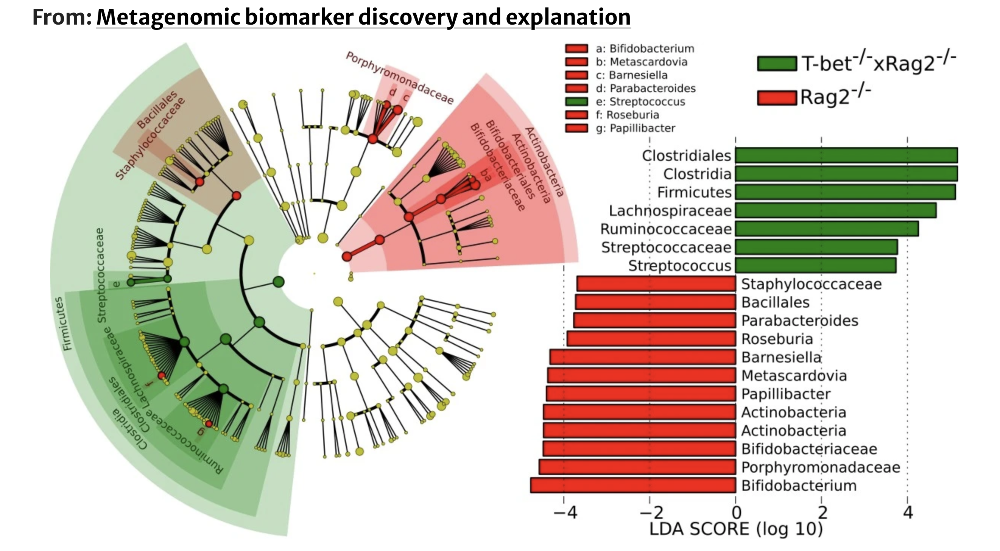

# CEfSe: A Pure Python-based Re-implementation of LEfSe using Cohen’s d Effect Size 

Nicholas Lund¹, Olivia Whitelaw¹

¹Department of Computer Science, University of Victoria, 3800 Finnerty Road, Victoria BC, V8P 5C2, Canada

## **ABSTRACT**

**Lefse is a metagenomic biomarker discovery tool that combines non-parametric statistical tests with LDA to identify microbial features that distinguish between biological classes. Its original implementation relies on Python 2 and an R bridge, making it difficult to run on modern systems. CEfSe aims to reimplement the LEfSe pipeline in pure Python 3 and replace its LDA-based effect size with Cohen’s d.**

## **INTRODUCTION**

Biomarkers in metagenomic data are features that distinguish microbial communities between phenotypes (1). Biomarkers are identified by measuring microbial abundances across samples and using statistical tests to determine which features differ between the sets of samples being compared (1). For example healthy vs. diseased individuals. 

Metagenomic datasets are notoriously hard to work with. These datasets have thousands of potential features but are made up of only a small number of samples; additionally, they come with sequencing noise and strong biological variability between groups (1). Because of this, identifying reliable biomarkers requires statistical methods that can handle this high-dimensional data. 

Most metagenomic tools can detect biomarkers, but don’t provide the biological context needed to show statistical significance, biological consistency, or effect size (1). LEfSe is built using a Python-R bridge to run its R-based statistical tests and LDA; then it maps the detected biomarkers onto a taxonomic tree to make the biological differences easier to interpret (1). The primary issue with this implementation is that it relies on outdated Python 2 code and requires an Intel-based R setup, which makes it difficult to run on modern systems. Migrating to Python 3 and eliminating the R dependencies should make the workflow lighter and more accessible.

## **MATERIALS AND METHODS**
>**Figure 1.**
>

>***Schematic representation of the statistical and computational steps implemented in Segata Lab’s LEfSe and CEfSe(1).***  LEfSe preprocesses the metagenomic input, a matrix of taxa (rows) by samples (columns), by cleaning feature names, completing taxonomy levels, extracting numeric values, and generating the class, subclass, and subject labels, with an optional normalization step (1). The formatted data is then used in three analyses:

**(a) Kruskal-Wallis rank-sum** is used to test whether the features differ across different biological classes. If the Kruskal-Wallis p-value < $\alpha$  (default 0.05) then the feature is kept, otherwise it is discarded. 

**(b) Pairwise Wilcoxon tests** checks that all the subclass comparisons support the same significant trend. The features that pass Wilcoxon’s are considered successful biomarkers.

**(c) Linear Discriminant Analysis (LDA)**  is used for effect size estimation. For each feature, LDA compares class means across bootstrap samples. Those differences are averaged and scaled to a log10 score. This process is repeated on multiple bootstrap samples (30 by default). 

## **DATASET**

Segata et al. (2011) validated LEfSe across five datasets:

1. Human Microbiome Project
2. T-bet⁻/⁻ × Rag2⁻/⁻ and Rag2⁻/⁻ mouse dataset  
3. Viral and microbial environmental data  
4. Infant and adult gut microbiome dataset  
5. Synthetic datasets for benchmarking false positives/negatives  

CEfSe was tested by reproducing the results from the mouse dataset. This dataset compares diseased mice (T-bet ⁻/⁻ × Rag2 ⁻/⁻) to healthy controls (Rag2⁻/⁻), which makes it the most reliable starting point for checking whether the pipeline behaves correctly. Using a two-class dataset also avoids the added Wilcoxon and LDA calculations required when more classes are involved (1).

## **DIFFERENCES BETWEEN LEfSe AND CEfSe**

>**Figure 2.**
>
>
>
>*CEfSe statistical workflow using Cohen’s d in place of LDA.*

### **1. Resolving Syntax Errors**  
In the first attempts to run the code under Python 2, it failed to execute because of several syntax errors. These were subsequently fixed. 

### **2. Porting to Python 3** 
This portion of the project involved porting Python 2 specific syntax and functions to run in a Python 3 environment. Many of the plotting functions relied on older library versions, so these sections were adapted a lot to align with updated APIs. 

### **3. Eliminating R Dependencies**  
LEfSe depends on several R components:

- `MASS` for LDA  
- `coin` and `modeltools` for Wilcoxon  
- `rpy2` to bridge Python and R  
- requires `x86 R` only  

CEfSe removes these dependencies and uses pure Python instead:

- `scipy.stats.kruskal` for Kruskal–Wallis  
- `scipy.stats.mannwhitneyu` for Wilcoxon  
- Cohen’s d to replace LDA effect size  

### **Substituting LDA with Cohen’s d**

The goal of the effect size is to quantify how strongly each feature separates the two classes (3). Cohen’s d was used to replace LDA because it provides a standardized measure of class separation without R or discriminant projections.

LDA computes effect size by projecting samples onto a discriminant axis (1). This gives each feature a score that reflects how well it helps discriminate between the two classes. 

**LDA (LEfSe):**

$$
\text{LDA effect} = \left| \mu_1(\text{LD}) - \mu_2(\text{LD}) \right|
$$

Cohen’s d gives the standardized mean difference between the two classes, and these values are used to rank biomarkers. CEfSe computes the class means and pooled SD using `NumPy`.

**Cohen’s d (CEfSe):**

$$
d = \frac{|\mu_1 - \mu_2|}{\sigma_{\text{pooled}}}
$$

$$
\sigma_{\text{pooled}} = \sqrt{\frac{\sigma_1^2 + \sigma_2^2}{2}}
$$

### **4. Fixing the Pipeline Controller**  
The original LEfSe pipeline acts as a wrapper that passes arguments to the LEfSe functions, however, it performs no error handling or diagnostics. If there are mistakes, it leads to a silent crash inside the R bridge making it impossible to trace back. CEfSe improves the pipeline by including structured logging, input and output path validation, parameter checking, and clear debugging messages. 

### **5. GitHub Actions Workflow**  
LEfSe does not include any CI/CD configuration. A GitHub Actions workflow was added so the updated LEfSe code can actually run in a clean environment. 

## **RESULTS**

>**Figure 3.**  
>
>>LEfSe Results: Cladogram and LDA Bar Plot

>**Figure 4.**
>
>>CEfSe Results: Cladogram and Cohen’s d Bar Plot
>>

>*A cladogram is used to show which microbial groups  are different between two classes and how those features are related to each other in the phylogenetic tree. The nodes are colored depending on which class shows higher levels of that feature (red representing high values and green low) (1). The bar chart's displays the effect sizes for each taxon, indicating both the direction and magnitude of their contribution to differences between the two microbial communities (1). CEfSe was run on the same T-bet⁻/⁻ × Rag2⁻/⁻ vs. Rag2⁻/⁻ dataset used in the original analysis. The original study reported 19 differentially abundant clades using LDA, and those same major taxa show up in CEfSe’s output as well (1).* 

### **Cladograms**

Both cladograms use the same taxonomic tree, but the colored regions differ because each method selects a different set of features as being enriched. This difference comes from switching the effect size calculation: LEfSe uses LDA scores, while CEfSe uses Cohen’s d. This makes sense because each method holds different statistical assumptions. In LEfSe, LDA is applied to each feature independently after the Kruskal-Wallis and Wilcoxon filtering steps, so the score reflects how well that single feature separates the classes (1). CEfSe replaces this with Cohen’s d, which standardizes the difference in class means using the pooled standard deviation (2). Because these two effect size measures scale features differently, some taxa cross the cut off under LDA but not under Cohen’s d, and vice versa.

### **Bar Plots**

To reiterate, the bar plots differ due to the difference in the way effect size is calculated for LDA and Cohen's d. All the taxa detected in LEfSe’s is also present in CEfSe’s bar plot because Cohen’s d admits a larger set of features above the effect size threshold. Even after  Kruskal-Wallis and Wilcoxon filtering, Cohen’s d tends to include more taxa because its standardized mean differences inflate when variance is low, pushing more features above the effect size threshold than LDA (1).

The effect size scores ranges differ: LDA goes from -4 to +4 because it’s a log scaled discriminant distance, whereas Cohen’s d stays around -1.5 to +1 because it’s a standardized mean difference. In the bar plot, LDA showed that Firmicutes were enriched in the T-bet⁻/⁻ × Rag2⁻/⁻ mice and the same result can be observed in the Cohen’s bar plot, where the same Firmicutes related taxa end up on the green side; this  includes  Firmicutes, Clostridiales, Lachnospiraceae, Streptococcaceae, and Ruminococcaceae. The Actinobacteria patterns reported by LDA are also preserved under Cohen’s d. 

Segata et al. (2011) note that Roseburia and Papillibacter are depleted in T-bet⁻/⁻ × Rag2⁻/⁻ mice even though Firmicutes is enriched overall. CEfSe matches this, showing both genera in the red (depleted) region.

Some of the visual differences in the cladograms and bar plots also come from the plotting tools themselves. LEfSe’s plotting code was written in Python 2, using legacy `biom` imports and an older `Matplotlib` API. In the updated pipeline, the same plotting logic is used but with newer `Matplotlib` and `NumPy` imports. Therefore the default settings change the node spacing, ring thickness, and where the labels and colored sectors are placed on the tree. 

## **CONCLUSION**

The primary objectives for CEfSe was to port the code from Python 2 to Python 3 and refactor the LEfSe pipeline. This was done by removing LEfSe’s Python-R bridge, which previously called R functions for the Kruskal-Wallis test, the Wilcoxon test, and swapping out LDA for Cohen’s d. These changes make the pipeline fully portable and able to run on any modern laptop without specialty R dependencies. Although switching from LDA to Cohen’s d changes how effect size is calculated, the major taxa highlighted by LEfSe also appear in CEfSe’s results. This suggests that the approach remains biologically meaningful. 

***Personal Reflection on the LEfSe Pipeline***

LEfSe has started to get some pushback in newer studies, and the PreLect paper (Chen et al. 2025) calls out a few familiar issues: it tends to over-select features, leans heavily on low-prevalence taxa, and its LDA scores can turn random noise into “biomarkers.” Basically, it gives you long lists that look scientific but aren’t always reproducible across cohorts. PreLect doesn’t evaluate LDA directly, but the weaknesses it identifies in LEfSe’s effect size step naturally raise the question of whether LDA is still the right model for this kind of data. On top of that, the original LEfSe repository is outdated, rarely maintained, and full of small but genuinely annoying syntax errors. All of this makes it reasonable to look beyond LDA. 

*Conflict of Interest*  None declared.

### **REFERENCES**

1.Segata, N., Izard, J., Waldron, L., Gevers, D., Miropolsky, L., Garrett, W.S. and Huttenhower, C. (2011) Metagenomic biomarker discovery and explanation. Genome Biology, 12, R60. doi: 10.1186/gb-2011-12-6-r60.

2.Chen, Y.C., Su, Y.Y., Chu, T.Y., Wu, M.F., Huang, C.C. and Lin, C.C. (2025) PreLect: prevalence-leveraged consistent feature selection decodes microbial signatures across cohorts. NPJ Biofilms and Microbiomes, 11(1), 3. doi: 10.1038/s41522-024-00598-2.

2.Cumming, G. (2012) ‘Cohen’s d’, in Understanding the New Statistics. 1st edition [Online]. United Kingdom: Routledge. pp. 281–320.
